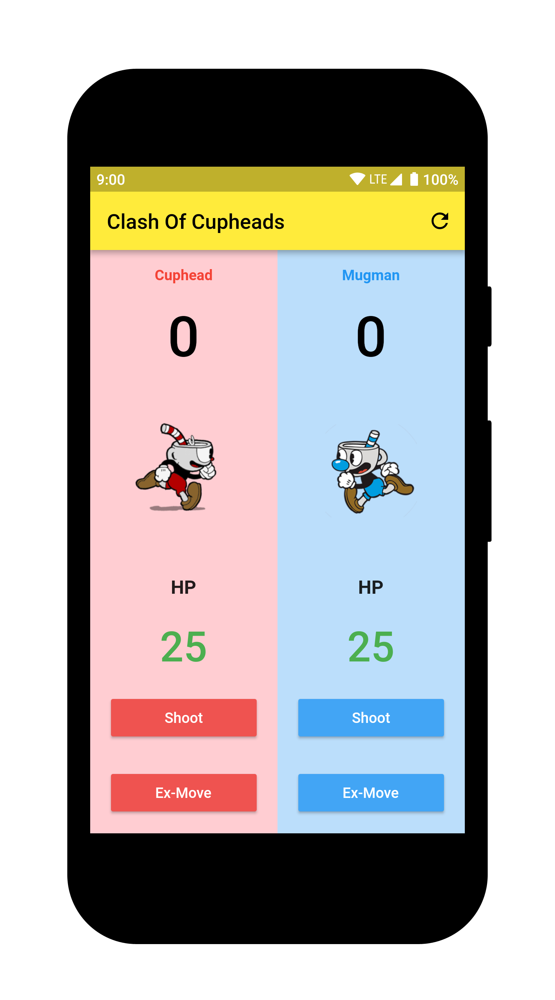
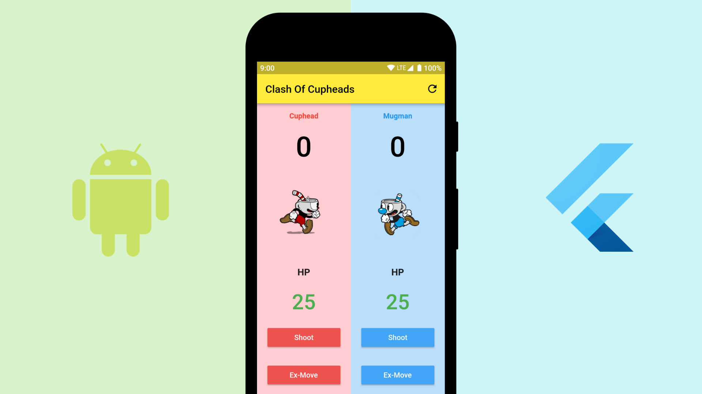

# Score Keeper

The goal is to create an Score Keeper app which gives a user the ability to keep track of the score of two different teams playing a game of your choice

## About

This application is a score keeper app, inspired by an indie video-game - [Cuphead](https://en.wikipedia.org/wiki/Cuphead)

## App Screenshot

## Medium Post

## Credits
| Drawable | Author | Source |
| --- | --- | --- |
| [cuphead_running.png](https://github.com/piedcipher/ABND-Projects-Flutter/blob/master/%232.Score-Keeper/score_keeper/assets/cuphead_running.png) | [LincolnDisaster19](http://es.cuppedia.wikia.com/wiki/Usuario:LincolnDisaster19) | [Source](https://vignette.wikia.nocookie.net/cuppedia/images/8/8c/Cuphead_running.png/revision/latest?cb=20171011215842&path-prefix=es) |
| [mugman_running.png](https://github.com/piedcipher/ABND-Projects-Flutter/blob/master/%232.Score-Keeper/score_keeper/assets/mugman_running.png) |  [GraviBot](http://supermarioglitchy4.wikia.com/wiki/User:GraviBot) |  [Source](https://vignette.wikia.nocookie.net/supermarioglitchy4/images/b/b3/Mugman_running.png/revision/latest?cb=20171022150410&format=original)|